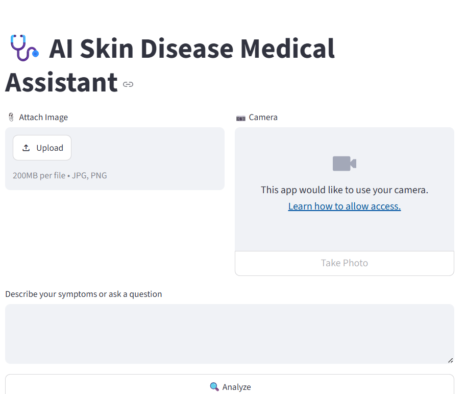
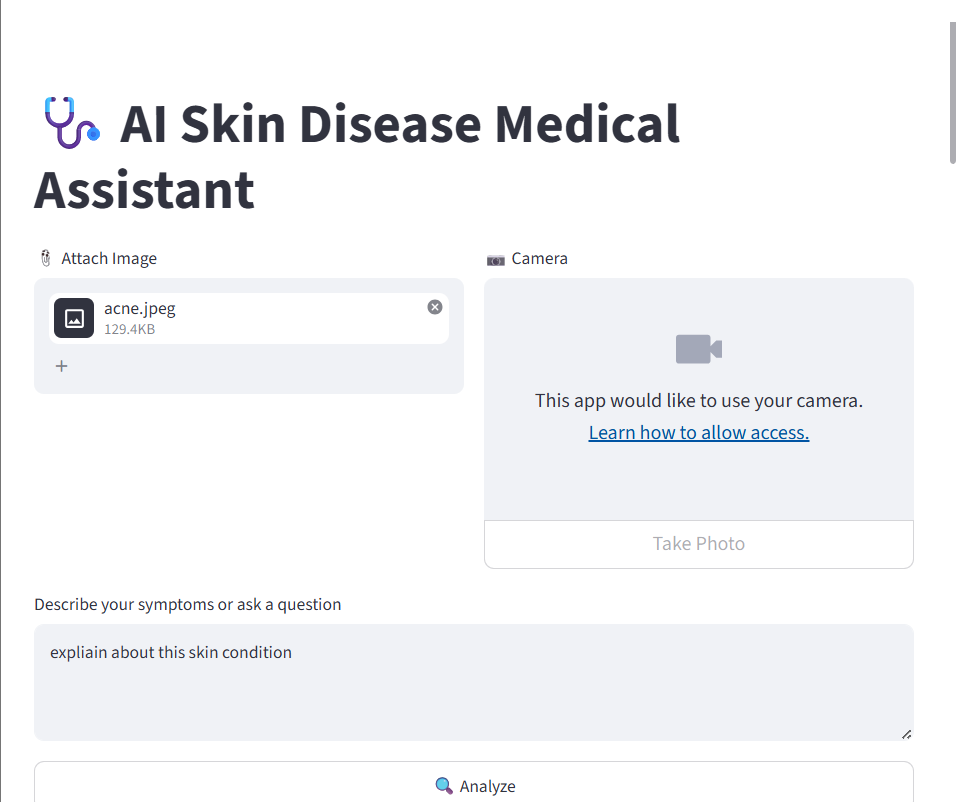
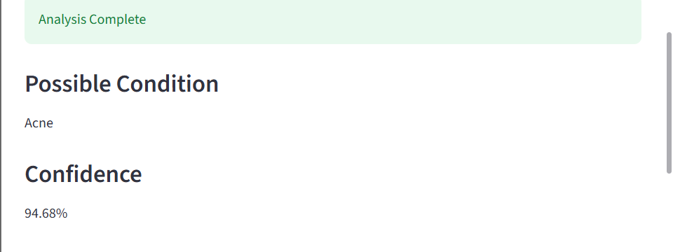
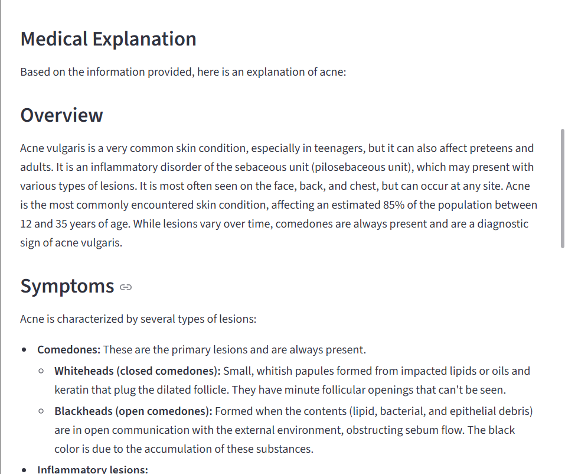

# 🩺 AI Skin Disease Medical Assistant

An AI-powered medical assistant that combines **Vision Transformers**, **Retrieval-Augmented Generation (RAG)**, **FAISS Vector Search**, and **Google Gemini AI** to analyze skin disease images and answer dermatology-related questions using trusted medical references.

---

##  Live Demo

🔗 **Try the application here:**  
https://ai-skin-disease-medical-assistant-urfayyu9ezdksdhq4sgvkk.streamlit.app/

---

##  GitHub Repository

https://github.com/sahana-cs-tech/AI-Skin-Disease-Medical-Assistant

---

##  Features

-  Skin disease prediction from uploaded images
-  Capture images directly using your device camera
-  Ask questions about symptoms, causes, treatments, and prevention
-  Retrieval-Augmented Generation (RAG) powered chatbot
-  Answers generated from medical textbook knowledge
-  FAISS vector similarity search for relevant information retrieval
-  Google Gemini AI for natural language responses
-  Confidence score for predicted disease
-  Displays medical reference sources
-  Educational medical disclaimer

---

#  Application Preview


### Home Page



### Image Upload & Symptoms



### Analysis Result



### Medical Chatbot



---

#  System Architecture

```text
                User
                  │
                  ▼
      Upload Image / Camera
                  │
                  ▼
      Vision Transformer Model
                  │
      Predicted Skin Disease
                  │
                  ▼
       Combine with User Query
                  │
                  ▼
     Sentence Transformer Embedding
                  │
                  ▼
          FAISS Vector Search
                  │
                  ▼
      Retrieve Medical Knowledge
                  │
                  ▼
        Google Gemini 2.5 Flash
                  │
                  ▼
      Final Medical Explanation
                  │
                  ▼
         Streamlit Web Interface
```

---

#  Tech Stack

| Category | Technologies |
|----------|--------------|
| Language | Python |
| Frontend | Streamlit |
| Vision Model | Vision Transformer (ViT) |
| NLP | Sentence Transformers |
| Vector Database | FAISS |
| LLM | Google Gemini 2.5 Flash |
| AI Models | Hugging Face Transformers |
| Image Processing | Pillow |
| Numerical Computing | NumPy |

---

#  Project Structure

```
AI-Skin-Disease-Medical-Assistant
│
├── data/
│   ├── Book1.pdf
│   ├── Book2.pdf
│   ├── Book3.pdf
│   └── Book4.pdf
│
├── src/
│   ├── chatbot_backend.py
│   ├── image_classifier.py
│   ├── retriever.py
│   ├── generate_embeddings.py
│   ├── create_faiss.py
│   └── ...
│
├── vector_db/
│   └── skin_disease.index
│
├── screenshots/
│
├── app.py
├── requirements.txt
├── chunks.json
├── all_pages.json
└── README.md
```

---

#  Installation

Clone the repository

```bash
git clone https://github.com/sahana-cs-tech/AI-Skin-Disease-Medical-Assistant.git
```

Go to the project folder

```bash
cd AI-Skin-Disease-Medical-Assistant
```

Install dependencies

```bash
pip install -r requirements.txt
```

Set your Gemini API key as an environment variable.

Run the application

```bash
streamlit run app.py
```

---

#  How It Works

1. Upload a skin image or capture one using the camera.
2. Enter symptoms or ask a medical question.
3. The Vision Transformer predicts the most likely skin disease.
4. The prediction is combined with the user's question.
5. FAISS retrieves the most relevant medical textbook content.
6. Gemini AI generates a context-aware medical explanation.
7. The application displays the prediction, confidence score, explanation, and reference sources.

---

#  Future Enhancements

- User authentication
- Patient history management
- PDF medical report generation
- Multi-language support
- Doctor consultation integration
- Top-3 disease predictions
- Explainable AI visualizations (Grad-CAM)
- Deployment using Docker

---

#  Disclaimer

This application is intended for **educational and informational purposes only**. It is **not a substitute for professional medical advice, diagnosis, or treatment**. Always consult a qualified healthcare professional for medical concerns.

---

#  Author

**Sahana C S**

GitHub: https://github.com/sahana-cs-tech

LinkedIn: *https://www.linkedin.com/in/sahana-c-s-35482531a*

---

## ⭐ If you found this project useful, consider giving it a Star on GitHub!
